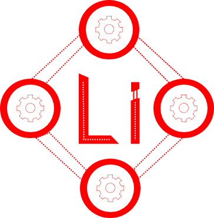

# Lithium

 
 
 

Welcome to the repository of Lithium. Lithium strives to be a easy and lightweigth tool for creating and maintaing microservices in a distributed fashion. We want to give you the opertunity to create your own implementations of certain tools that are used in the library and can be plugged into a service or a loader balancer.

## What we want to achieve

As stated in the first part of the Page, we want to create an easy to use microservice tool that should help people to get up and running with microservices in golang. We want to give the developer the power to use features that we provide or just to overwrite them with his own tools.

## Batteries included

As a easy to use tool, we want to include all the batteries that you could need in order to create your system. So in the future we want to provide the following batteries:
* Logwriter 
* Log Analytics
* Service Discovery
* Load Balancer
* Stress Tester
* Fitness Tracker (For the service not for the developer)
* DDOS Protection
* Secure Connection between Services
* Database connections (probably MYSQL, Cockroach and/or Cassandra)

## Versioning

The versioniong and the tags in git follow a 4 step path so that the current step can be easily identified.

Example: v0.0.0.1

The rightmost part stands for minor changes or just maintnance.
The second rightmost stands for regular updates to the codebase, like refactoring or small rewrites.
The second leftmost element represents bug fixes and rewrites and changes to the interface of the library.
The leftmost signals information about big changes as well as certain publication steps such as production ready etc.

## Usage

At the moment Lithium allows you to use its first implementation of services threw the configuration of a configuration file.
The needed endpoints are written in a normal go file by importing the Lithium Server package.
They are bound to the internal http server of the service and are started if the http server spins up.

You can set the security mode you want to have on your service by setting a variable in the service. If you choose the TLS mode, the service will generate the needed keys for the TLS connection. 
By setting a different variable, you can let the service perform a port scan of the host maschine to secure the usage of the maschine.

## Features

* Usage of multiple databases
* Dashboard for each service
* Automatic packing into a docker container
* Compilation to specified domain
* Self destruction function to kill the service and the database on the maschine in order to protect its data.
* Health report on demand 